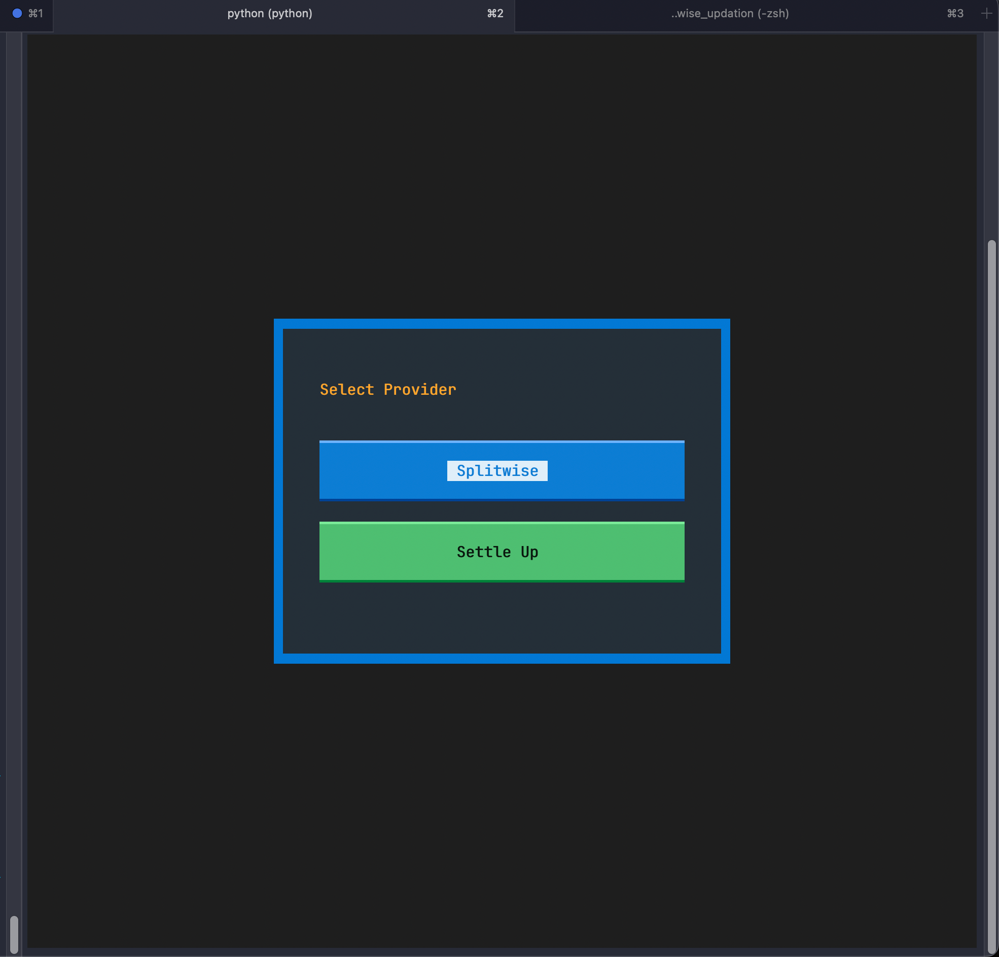
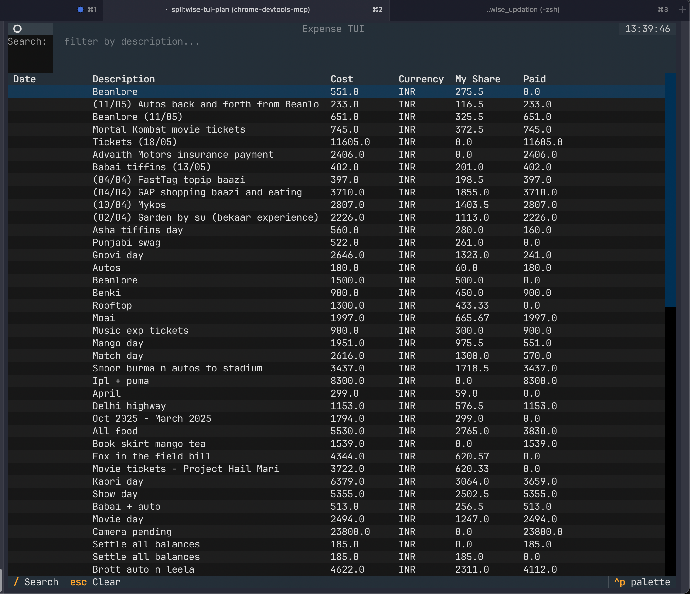
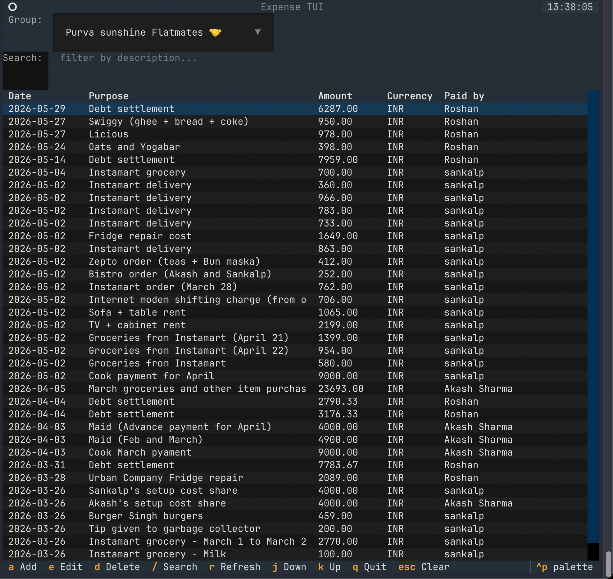
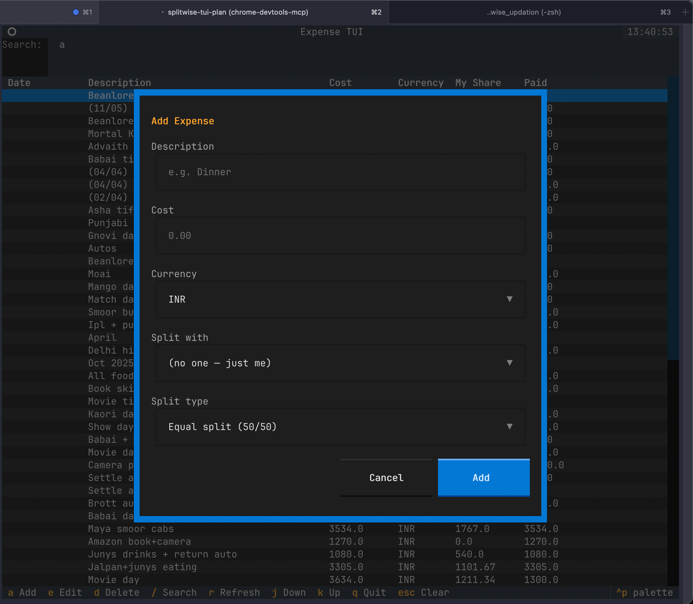

```
 ███████╗██╗  ██╗██████╗ ████████╗██╗   ██╗██╗
 ██╔════╝╚██╗██╔╝██╔══██╗╚══██╔══╝██║   ██║██║
 █████╗   ╚███╔╝ ██████╔╝   ██║   ██║   ██║██║
 ██╔══╝   ██╔██╗ ██╔═══╝    ██║   ██║   ██║██║
 ███████╗██╔╝ ██╗██║        ██║   ╚██████╔╝██║
 ╚══════╝╚═╝  ╚═╝╚═╝        ╚═╝    ╚═════╝ ╚═╝
```

<div align="center">

**A terminal UI for Splitwise & Settle Up — no browser required.**

[](https://python.org)
[](https://textual.textualize.io)
[](LICENSE)

</div>

---

## Why this exists

Splitwise and Settle Up are great apps — until they aren't:

- **Splitwise caps how far back you can edit expenses** in the free tier
- **Settle Up locks bulk edits** behind the premium paywall  
- Both apps make **batch operations** painfully slow through their UIs
- No way to **keyboard-navigate** through 200+ expenses quickly
- Mobile-first UIs are frustrating on desktop for power users

`exptui` bypasses all of that by talking directly to their APIs from your terminal.  
Full CRUD. No paywalls. No click fatigue.

---

## Screenshots

**Provider selector — choose Splitwise or Settle Up at launch**



**Splitwise — full expense list with amount, currency, your share**



**Settle Up — grouped by flatmate group, payer column included**



**Add expense modal — description, cost, currency, split type**



---

## Features

| | |
|---|---|
| ⚡ **Keyboard-first** | Vim bindings (`j`/`k`), every action one keypress |
| 🔓 **Bypasses platform limits** | Edit any expense regardless of age or plan tier |
| 🔍 **Live search** | Debounced filter across all expenses as you type |
| ✏️ **Full CRUD** | Add, edit, delete — changes reflect immediately in the app |
| 🏠 **Group-aware** | Settle Up group switcher built-in |
| 🔄 **Auto token refresh** | Firebase tokens refresh silently; new token persisted to config |
| 💾 **Zero cloud dependency** | All data stays between you and the provider's API |
| 🎨 **Clean dark UI** | Textual-powered, properly styled with TCSS |

---

## Install

```bash
git clone https://github.com/Akash-Sharma-1/expTUI
cd expTUI
pip install -r requirements.txt
```

---

## Configuration

All credentials live in one file:

```bash
mkdir -p ~/.config/exp-tui
nano ~/.config/exp-tui/config.toml
```

### Splitwise

Get your API key at [secure.splitwise.com/apps](https://secure.splitwise.com/apps).

```toml
api_key = "your-splitwise-api-key"
default_currency = "INR"
page_size = 50
```

### Settle Up

Settle Up uses Firebase Auth. Grab credentials from your active browser session on [settleup.app](https://settleup.app).

**Open DevTools console on settleup.app and run:**

```js
const db = await new Promise((res, rej) => {
  const r = indexedDB.open('firebaseLocalStorageDb');
  r.onsuccess = () => res(r.result);
  r.onerror = rej;
});
const store = db.transaction('firebaseLocalStorage','readonly').objectStore('firebaseLocalStorage');
const all = await new Promise((res,rej) => { const r=store.getAll(); r.onsuccess=()=>res(r.result); r.onerror=rej; });
const v = all[0].value;
console.log('firebase_api_key =', v.apiKey);
console.log('refresh_token    =', v.stsTokenManager.refreshToken);
console.log('uid              =', v.uid);
```

Add to config:

```toml
[settleup]
firebase_api_key = "AIzaSy..."
refresh_token    = "AMf-vBz..."
uid              = "your-firebase-uid"
```

### Both providers

Configure both sections — a provider selector appears at startup.

---

### Environment variable overrides

| Provider  | Env var                     | Config key                    |
|-----------|-----------------------------|-------------------------------|
| Splitwise | `SPLITWISE_API_KEY`         | `api_key`                     |
| Settle Up | `SETTLEUP_FIREBASE_API_KEY` | `[settleup] firebase_api_key` |
| Settle Up | `SETTLEUP_REFRESH_TOKEN`    | `[settleup] refresh_token`    |
| Settle Up | `SETTLEUP_UID`              | `[settleup] uid`              |

---

## Run

```bash
python -m exptui
```

---

## Keybindings

| Key        | Action                       |
|------------|------------------------------|
| `a`        | Add expense / transaction    |
| `e`        | Edit selected row            |
| `d`        | Delete selected row          |
| `/`        | Focus search / filter        |
| `r`        | Refresh from API             |
| `j` / `k`  | Move down / up               |
| `q`        | Quit                         |
| `Escape`   | Dismiss modal / clear search |

---

## Project structure

```
exptui/
├── __main__.py              # Entry point, provider routing
├── config.py                # load_config() — TOML + env vars
│
├── api/                     # Splitwise
│   ├── client.py            # SplitwiseClient (httpx, Bearer token)
│   └── models.py            # Expense, User, Friend, Group, Split
│
├── settleup/                # Settle Up
│   ├── auth.py              # FirebaseAuth — refresh token → ID token
│   ├── client.py            # SettleUpClient (Firebase Realtime DB REST)
│   └── models.py            # SUTransaction, SUGroup, SUMember
│
├── screens/
│   ├── provider_select.py   # Startup provider picker
│   ├── main.py              # Splitwise main screen
│   ├── add_expense.py       # Splitwise add modal
│   ├── edit_expense.py      # Splitwise edit modal
│   ├── confirm_delete.py    # Shared delete confirmation
│   ├── settleup_main.py     # Settle Up main screen
│   ├── settleup_add.py      # Settle Up add modal
│   └── settleup_edit.py     # Settle Up edit modal
│
├── widgets/
│   ├── expense_table.py     # DataTable with ID tracking
│   ├── search_bar.py        # Debounced search (300ms)
│   └── status_bar.py        # Bottom bar: user, count, hints
│
└── styles/
    └── app.tcss             # All layout and colour (no inline styles)
```

---

## Stack

- [Textual](https://textual.textualize.io/) — async TUI framework
- [httpx](https://www.python-httpx.org/) — async HTTP client
- [tomli](https://github.com/hukkin/tomli) — TOML config parsing (Python < 3.11)

---

## Contributing

PRs welcome. Keep changes focused — one feature or fix per PR.

---

<div align="center">
Made for terminal lovers who don't want to open a browser just to fix a typo in a ₹340 expense.
</div>
